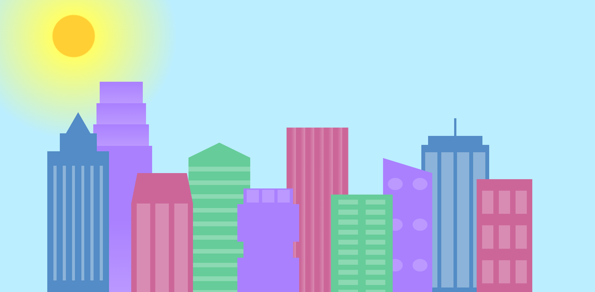

# City Skyline
This project is a simple representation of a city skyline using HTML and CSS. It creates a visually appealing skyline with background and foreground buildings.

## Preview


## Getting Started
To view the city skyline, you can follow these steps:
- Clone the repository or copy the HTML code.
- Open the index.html file in a web browser.
- A visually appealing skyline with background and foreground buildings will be displayed.

## Structure
The HTML code is divided into two main sections:
- Background Buildings: This section represents the background buildings of the city skyline. It includes nested <div> elements with class names such as building-wrap, window-wrap, and bb1-window. These class names are used to style and position the elements using CSS.
- Foreground Buildings: This section represents the foreground buildings of the city skyline. Similar to the background buildings section, it contains nested ```<div>``` elements with class names like building-wrap, window-wrap, and fb1a.

## Day to Night Transition
The city skyline in this project features a dynamic day to night transition effect. This effect is achieved through a media query in the CSS code. When the viewport width is below 1000 pixels, the colors of the buildings and sky change to create a nighttime atmosphere.

During the daytime, the buildings and windows are styled with vibrant colors. However, as the viewport width decreases, indicating a smaller screen or mobile device, the colors change to darker shades, representing a nighttime scene.

You can experience the day to night transition by resizing the browser window or viewing the skyline on different devices with varying screen sizes.

## Author
This project was created by Kalutu Daniel.

## Credits
This project is based on a challenge from the freeCodeCamp CSS course.
